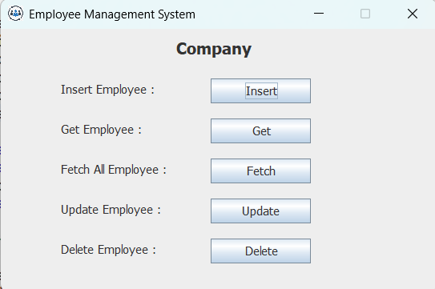
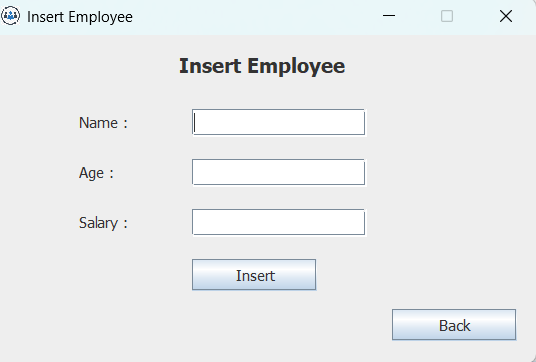
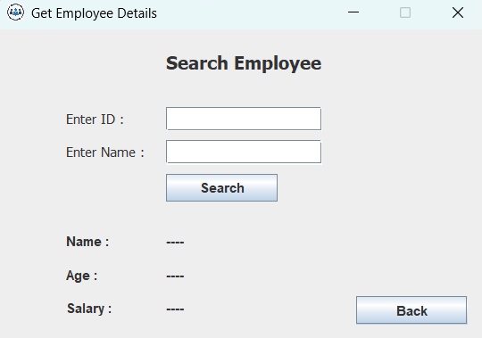
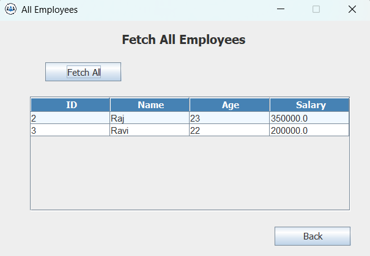
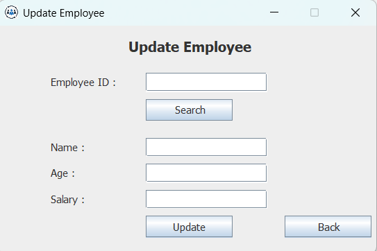
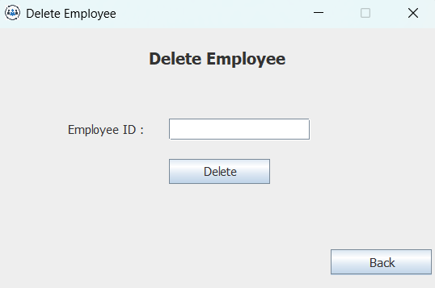

# Employee Management System

A desktop application built using **Java Swing and JDBC** to manage employee records with a MySQL database.

---

## Author

Rajashekharayya S Hiremath  
Electronics and Communication Engineering  
LinkedIn: https://linkedin.com/in/rajashekharayya-s-hiremath-68580b301/

---

## Features

- Insert new employee details  
- Search employee by **ID or Name**  
- Fetch all employees using **JTable**  
- Update employee details  
- Delete employee records  
- Input validation and confirmation dialogs  
- Clean GUI built with Java Swing

---

## Technologies Used

- Java  
- Java Swing  
- JDBC  
- MySQL  

---

## Project Structure

src/company

MainFrame.java  
InsertEmployeeFrame.java  
GetEmployeeFrame.java  
UpdateEmployeeFrame.java  
DeleteEmployeeFrame.java  
FetchAllEmployeeFrame.java  
DBConnection.java  

---

## Database Setup

Create the database in MySQL:

```sql
CREATE DATABASE employee_db;

USE employee_db;

CREATE TABLE employee(
id INT AUTO_INCREMENT PRIMARY KEY,
name VARCHAR(50),
age INT,
salary DOUBLE
);
```

Open **DBConnection.java** and update your MySQL password.

Example:

```java
Connection con = DriverManager.getConnection(
"jdbc:mysql://localhost:3306/employee_db",
"root",
"your_password"
);
```

---

## Download Application

Download and run the application using the runnable jar file:

[Download EmployeeManagementSystem.jar](employeemanagement.jar)

**Note:** Change the password in `DBConnection.java` to match your MySQL password before running the application.

---

## Application Screenshots

### Main Window


### Insert Employee


### Insert Employee


### Fetch All Employees


### Update Employee


### Delete Employee



---

## How to Run

1. Install **Java (JDK 8 or above)**  
2. Install **MySQL**  
3. Create the database and table using the SQL commands above  
4. Update database password in **DBConnection.java**  
5. Run **MainFrame.java** or execute the **JAR file**

---
